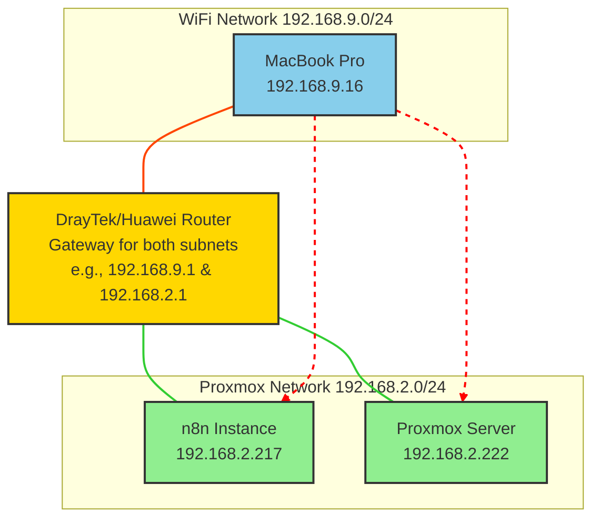

# 🌐 DrayTek/Huawei Router Configuration for Inter-Subnet Routing

This guide explains how to configure a DrayTek or Huawei router to allow communication between two different subnets. This is necessary when you have devices on one network (e.g., your MacBook Pro on a Wi-Fi network) that need to access services on another network (e.g., a Proxmox server on a wired network).

## The Problem

Your network is divided into at least two subnets:

*   **`192.168.9.0/24`**: The network your MacBook Pro is on.
*   **`192.168.2.0/24`**: The network your Proxmox server and n8n instance are on.

Without a specific route, devices on one subnet cannot communicate with devices on the other. The router that connects these two subnets needs to be configured to forward traffic between them.

## Network Diagram

## The Solution: Static Route

To solve this, you need to add a **static route** to your router's configuration. This tells the router how to forward traffic from one subnet to the other.

### General Steps

1.  **Access your router's web interface:**
    *   Open a web browser and enter your router's IP address. This is usually `192.168.1.1`, `192.168.0.1`, or the "Gateway" address from your computer's network settings.
    *   Log in with your administrator username and password.

2.  **Find the static route settings:**
    *   **For DrayTek routers:** Look for a menu called `LAN` -> `Static Route`.
    *   **For Huawei routers:** Look for a menu called `LAN` -> `Static Route` or `Advanced` -> `Routing`.
    *   The exact location may vary depending on your router's model and firmware version.

3.  **Add a new static route:**
    *   You will need to create a new route with the following information:
        *   **Destination Network:** `192.168.2.0` (the network you want to reach)
        *   **Subnet Mask:** `255.255.255.0` (for a /24 network)
        *   **Gateway:** This will be the IP address of the router on the *same subnet* as the device making the request. In this case, it would likely be the router's IP on the `192.168.9.0/24` network. However, if the router is managing both LANs, it might just need the destination and the interface (e.g., LAN1, LAN2). If the router has IPs on both subnets (e.g. 192.168.9.1 and 192.168.2.1), it should be able to route between them automatically if "Inter-LAN routing" or a similar feature is enabled. If it is not, you may need to create a route.

    *   **Example Configuration:**

        *   **Destination IP:** `192.168.2.0`
        *   **Subnet Mask:** `255.255.255.0`
        *   **Gateway IP:** This depends on your router's setup. If your router has an IP in the `192.168.9.0/24` range, you might not need a gateway, but instead specify the LAN interface to route to. If you're creating the route for the `192.168.9.0/24` network to reach the `192.168.2.0/24` network, the gateway should be the router's own IP that connects to the `192.168.2.0/24` network. For many consumer/prosumer routers with multiple LAN subnets, this routing is handled automatically once the subnets are defined.

    *   **If your router has "Inter-LAN/VLAN routing":**
        *   Look for a setting like `LAN` -> `General Setup` or `VLAN` settings.
        *   Ensure that "Inter-LAN routing" or "Inter-VLAN routing" is enabled. This is often a simple checkbox.

4.  **Save and apply the changes:**
    *   Save your new static route and apply the changes. The router may need to reboot.

### Disclaimer

The steps above are general guidelines. The exact menus and options may vary depending on your specific router model and firmware version. Please consult your router's documentation for more detailed instructions.
